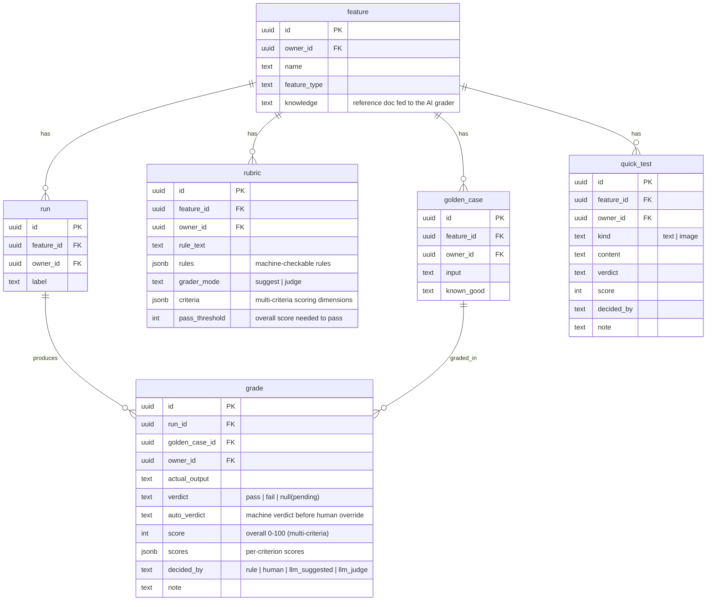

# Move 4: The Domain Model

> **The schema the whole tool runs on: a feature, the golden cases and rubric under it, the runs against it, a grade per case per run, plus a per-feature knowledge doc and ad-hoc quick tests. Every row is owned, and the walls between owners are the database's job.**

## The Schema

`feature` is the root. Under it sit its `golden_case`s, its versioned `rubric`s, its
`run`s (each producing a `grade` per case), its free-form `knowledge` doc, and its
ad-hoc `quick_test`s.



The live schema is reproduced in `supabase/migrations/` (vendored from the project's
migration history), so a fresh Supabase project rebuilds it with `supabase db push`.

## The Rubric Rule Vocabulary

`rubric.rules` is a jsonb array of machine-checkable rule objects. The grading engine (`src/lib/grading.js`) supports eight types:

| Type | Shape | Fails when |
| --- | --- | --- |
| `max_length` | `{ type, value }` | `actual.length > value` |
| `min_length` | `{ type, value }` | `actual.length < value` |
| `must_contain` | `{ type, value }` | `value` is absent (case-insensitive substring) |
| `must_not_contain` | `{ type, value }` | `value` is present (case-insensitive substring) |
| `exact_match` | `{ type }` | trimmed `actual` ≠ trimmed `known_good` |
| `count_equals` | `{ type, token, value }` | occurrences of `token` ≠ `value` (case-insensitive) |
| `rouge_l` | `{ type, value }` | ROUGE-L (LCS F-measure) vs `known_good` `< value` (0–1) |
| `jaccard` | `{ type, value }` | Jaccard token overlap vs `known_good` `< value` (0–1) |

Rules evaluate in order and the **first failure wins** (`decided_by: 'rule'`). The two
similarity types (`rouge_l`, `jaccard`) are pure deterministic JS — no model call — and
measure how close the output is to the known-good answer.

When a rubric has **no** machine rules, the case is *fuzzy*, and `rubric.grader_mode`
decides how it's graded (all AI paths use Claude when `ANTHROPIC_API_KEY` is set, else a
deterministic heuristic; the feature's `knowledge` doc is injected as `SOURCE / REFERENCE`):

- **`suggest`** (default) — `suggestPossibleFailure` stores the grade **pending** (`grade.verdict` is `NULL`) with `decided_by: 'llm_suggested'` and a hint note. The AI does not set the verdict.
- **`judge`** — scores the case and stores a real `verdict` (`pass`/`fail`) with `decided_by: 'llm_judge'`. With no `criteria`, `judgeByLLM` returns a `[confidence] rationale` note. With `criteria` set, `judgeMultiByLLM` scores **each criterion 0–100** plus an `overall_score` (stored in `grade.score` / `grade.scores`) and passes when `overall ≥ rubric.pass_threshold`.

Either way a person can confirm or override in Results, which sets/replaces the verdict and flips `decided_by` to `'human'`. `grade.verdict` is nullable precisely to hold the `suggest`-mode pending state, and `grade.decided_by` is one of `rule | human | llm_suggested | llm_judge`. All grader wrappers live in `src/lib/grading.js`; the Anthropic calls (text, image, multi-criteria) live in the server-only `src/lib/grading-claude.js`.

## Knowledge, Quick Test, and the Confusion Matrix

Three additions sit alongside the core grade loop:

- **`feature.knowledge`** — a per-feature reference document (e.g. brand guidelines) edited in the **Knowledge** tab, before the golden set. It's threaded into every AI grading prompt as context; machine rules ignore it.
- **`quick_test`** — an ad-hoc, saved check: grade one piece of **text or an image** against the rubric + knowledge without a run or golden case. Images go through a vision judge (machine rules can't see pixels). Each test is logged with its verdict / score / note. A **Stability** check on the same screen grades one input N times to measure the AI's consistency (verdict agreement + score variance) — reliability, not accuracy.
- **`grade.auto_verdict`** — captured at grade time, it preserves the machine's verdict so a later human override doesn't erase it. Results uses it to draw a **machine-vs-human confusion matrix** (false-pass / false-fail) plus Accuracy / Precision / Recall / F1. Ground truth is the human verdict, so the matrix covers human-reviewed cases only.

## The Run-to-Run Comparison Keys

The point of the tool is to answer "did my fix help, or break something else?" That needs two runs lined up case-by-case. The keys that make that join exact:

- **`golden_case_id`** — the same case across every run. A grade in run v1 and a grade in run v2 are *the same case* when they share this id. This is the spine of the Compare screen.
- **`run.feature_id`** — scopes which runs belong together (you only compare runs of the same feature).
- **`grade(run_id, golden_case_id)`** — one grade per case per run; comparing v1→v2 is a join on `golden_case_id` filtered to the two `run_id`s.

So "case 3 went fail → pass" is `grade` where `golden_case_id` is constant and `verdict` differs between the two `run_id`s. See `GET /api/features/:id/compare?run1=&run2=`.

## Row Level Security

Every table (`feature`, `golden_case`, `rubric`, `run`, `grade`, `quick_test`) has RLS on with an **own-rows-only** policy (`owner_id = auth.uid()`). `owner_id` defaults to `auth.uid()` on insert, so the app never sets it by hand and can't get it wrong.

Child tables add a second clause: the **parent must also be yours**. A user cannot attach a golden case, rubric, run, or quick test to a feature they don't own — even though RLS already hides that feature from them:

```sql
with check (
  owner_id = auth.uid()
  and exists (select 1 from feature f where f.id = feature_id and f.owner_id = auth.uid())
)
```

The per-user signup trigger (`handle_new_user_default_feature`) and its provisioning
helpers are `SECURITY DEFINER`; their `EXECUTE` is revoked from `anon`/`authenticated` so
they can't be called over REST to seed rows into another user's account — the trigger
still fires on signup.
