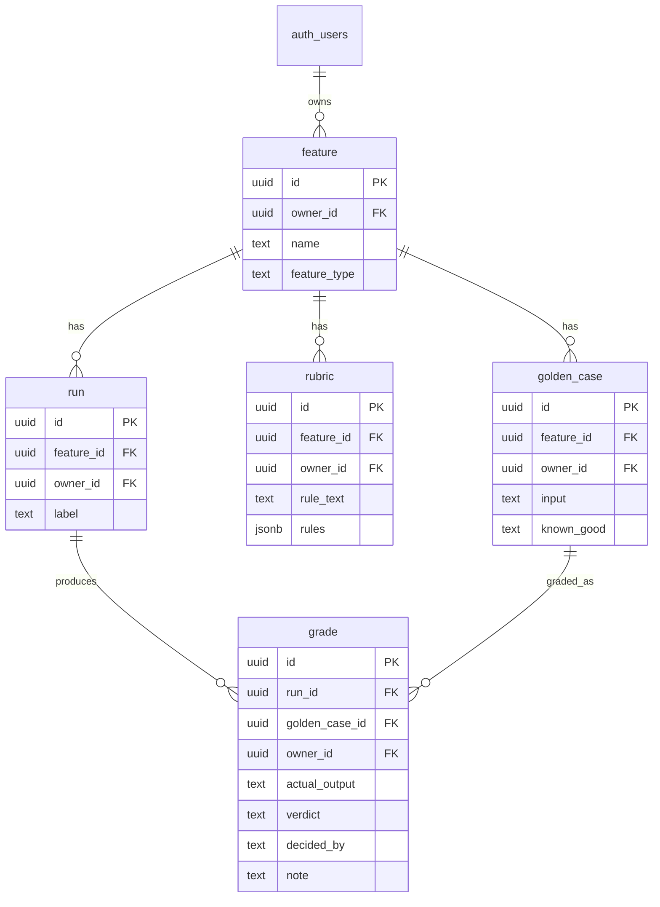

# Move 4: The Domain Model

> **The schema the whole tool runs on: a feature, the golden cases and rubric under it, the runs against it, and a grade per case per run. Every row is owned, and the walls between owners are the database's job.**

## The Schema



## The Run-to-Run Comparison Keys

The point of the tool is to answer "did my fix help, or break something else?" That needs two runs lined up case-by-case. The keys that make that join exact:

- **`golden_case_id`** — the same case across every run. A grade in run v1 and a grade in run v2 are *the same case* when they share this id. This is the spine of the Compare screen.
- **`run.feature_id`** — scopes which runs belong together (you only compare runs of the same feature).
- **`grade(run_id, golden_case_id)`** — one grade per case per run; comparing v1→v2 is a join on `golden_case_id` filtered to the two `run_id`s.

So "case 3 went fail → pass" is `grade` where `golden_case_id` is constant and `verdict` differs between the two `run_id`s. See `GET /api/features/:id/compare?run1=&run2=`.

## Row Level Security

Every table has RLS on with an **own-rows-only** policy (`owner_id = auth.uid()`). `owner_id` defaults to `auth.uid()` on insert, so the app never sets it by hand and can't get it wrong.

Child tables add a second clause: the **parent must also be yours**. A user cannot attach a golden case, rubric, or run to a feature they don't own — even though RLS already hides that feature from them:

```sql
with check (
  owner_id = auth.uid()
  and exists (select 1 from feature f where f.id = feature_id and f.owner_id = auth.uid())
)
```