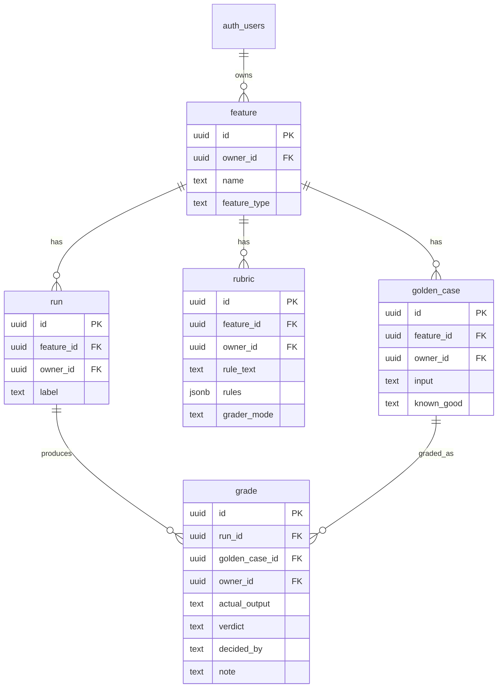

# Move 4: The Domain Model

> **The schema the whole tool runs on: a feature, the golden cases and rubric under it, the runs against it, and a grade per case per run. Every row is owned, and the walls between owners are the database's job.**

## The Schema

[](https://mermaid.live/edit#pako:eNp9Ul1PwjAU_SvL9bXgYO6rGhPcYDFRTKa8aI2pawcLYyVdpyDy3-02EDHR-9Rzzj33nIduIBGMA4Y0F-_JjEplPISkMPSMngiMhoOHSTwk8NxyUaDJ6O4mHI6NYHB_EGLNx5Or-Do4UJNxQ44P7tocD8Lhxas8vZyKnPHiJaElf8lYQ8mq2D_fuGRZolrvrpDR6VzqCj9RfAR01q5mjT8JHGcQ-DSi73K7lTZzL7VqktOyDHlqLHOaFUaa5Tk-SZtBpZJizvGJ2QxKRC7kHp3_ss_5-l9zCzvvGVMzbC1Xf18zRigKUIzq3k2pIzGqkzQDCKYyY4CVrDiCBZcLWkPY1NsE1IwvOAGsn4zKOQFSbLVnSYtHIRaAU5qX2idFNZ19o2rJqOJhRqeS_tjhBeMyEFWhAFtecwTwBlaAe57b7Vum5VmO5fm2b9sI1pq23K5run3TcT3Hsc2et0Xw0eSaXfus55tO369lz_VcBJxlSsjb9nc2n3T7Bdziy_o)



## The Rubric Rule Vocabulary

`rubric.rules` is a jsonb array of machine-checkable rule objects. The grading engine (`src/lib/grading.js`) supports six types:

| Type | Shape | Fails when |
| --- | --- | --- |
| `max_length` | `{ type, value }` | `actual.length > value` |
| `min_length` | `{ type, value }` | `actual.length < value` |
| `must_contain` | `{ type, value }` | `value` is absent (case-insensitive substring) |
| `must_not_contain` | `{ type, value }` | `value` is present (case-insensitive substring) |
| `exact_match` | `{ type }` | trimmed `actual` ≠ trimmed `known_good` |
| `count_equals` | `{ type, token, value }` | occurrences of `token` ≠ `value` (case-insensitive) |

Rules evaluate in order and the **first failure wins** (`decided_by: 'rule'`). When a rubric has **no** machine rules, the case is *fuzzy*, and `rubric.grader_mode` decides how it's graded (both paths use Claude when `ANTHROPIC_API_KEY` is set, else a deterministic heuristic):

- **`suggest`** (default) — `suggestPossibleFailure` stores the grade **pending** (`grade.verdict` is `NULL`) with `decided_by: 'llm_suggested'` and a hint note. The AI does not set the verdict.
- **`judge`** — `judgeByLLM` scores the case and stores a real `verdict` (`pass`/`fail`) with `decided_by: 'llm_judge'` and a `[confidence] rationale` note. This is the AI acting as a first-pass grader.

Either way a person can confirm or override in Results, which sets/replaces the verdict and flips `decided_by` to `'human'`. `grade.verdict` is nullable precisely to hold the `suggest`-mode pending state, and `grade.decided_by` is one of `rule | human | llm_suggested | llm_judge`. Both `grading.js` functions live in `src/lib/grading.js` (the Anthropic calls themselves in the server-only `src/lib/grading-claude.js`).

## The Run-to-Run Comparison Keys

The point of the tool is to answer "did my fix help, or break something else?" That needs two runs lined up case-by-case. The keys that make that join exact:

- **`golden_case_id`** — the same case across every run. A grade in run v1 and a grade in run v2 are *the same case* when they share this id. This is the spine of the Compare screen.
- **`run.feature_id`** — scopes which runs belong together (you only compare runs of the same feature).
- **`grade(run_id, golden_case_id)`** — one grade per case per run; comparing v1→v2 is a join on `golden_case_id` filtered to the two `run_id`s.

So "case 3 went fail → pass" is `grade` where `golden_case_id` is constant and `verdict` differs between the two `run_id`s. See `GET /api/features/:id/compare?run1=&run2=`.

## Row Level Security

Every table has RLS on with an **own-rows-only** policy (`owner_id = auth.uid()`). `owner_id` defaults to `auth.uid()` on insert, so the app never sets it by hand and can't get it wrong.

Child tables add a second clause: the **parent must also be yours**. A user cannot attach a golden case, rubric, or run to a feature they don't own — even though RLS already hides that feature from them:

```sql
with check (
  owner_id = auth.uid()
  and exists (select 1 from feature f where f.id = feature_id and f.owner_id = auth.uid())
)
```